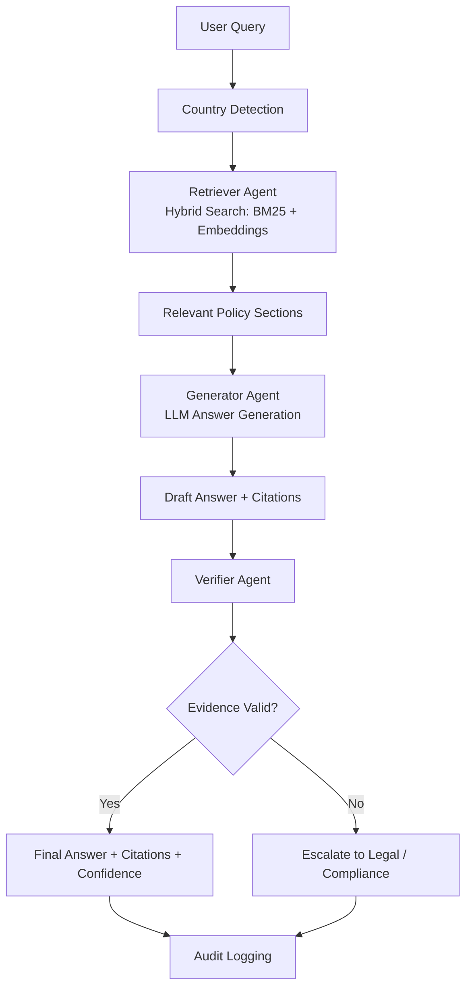

# EOR Compliance Copilot
**Multi-Agent AI System for Policy-Grounded Compliance Assistance**

## Overview
This project implements a prototype AI compliance copilot designed to answer Employer-of-Record (EOR) policy questions using internal policy documentation.

The system demonstrates how a **multi-agent architecture** can provide reliable, evidence-grounded answers while enforcing verification, safety checks, and escalation paths required in HR and legal compliance environments.

Agents in the system:
- **Retriever** – finds relevant policy sections using hybrid retrieval (BM25 + embeddings)
- **Generator** – produces grounded answers using retrieved evidence
- **Verifier** – validates citations and evidence consistency
- **Safety Layer** – handles audit logging, escalation, and PII protection

Quick links:
- System design: `SYSTEM_DESIGN.md`
- Evaluation plan: `evaluation/EVALUATION.md`

---

## System Architecture



---

## Key Capabilities

### Hybrid Retrieval
Policy documents are retrieved using:
- **BM25 lexical search**
- **Sentence-transformer semantic embeddings**

Hybrid scoring improves accuracy for compliance queries containing both legal terminology and natural language.

### Evidence-Grounded Answers
The generator produces answers strictly from retrieved policy sections with explicit citations:

```
doc_id | section | timestamp
```

### Verification Layer
The verifier agent checks:
- citation validity
- conflicting policy sources
- outdated policy versions
- unsupported claims

If the answer cannot be validated, the system **escalates instead of guessing**.

### Safety and Governance
The system includes:
- audit logging
- PII redaction
- escalation logic
- confidence scoring

These safeguards are essential for HR, payroll, and employment compliance systems.

---

## Example Interaction

**Query**
```
Can we terminate during probation in Germany?
```

**Retrieved Evidence**
```
DE_termination_v1 – Termination During Probation
```

**Answer**
```
Employees in Germany may be terminated during the probation period
with a two-week notice period unless otherwise specified in the
employment contract.
```

**Citation**
```
DE_termination_v1 | Termination During Probation | 2025-01-01
```

Confidence: Medium  
Reason: Answer supported by retrieved policy evidence  
Escalation: None

---

## Project Structure

```
src/
  agents/
    retriever.py      # Hybrid policy retrieval
    generator.py      # LLM answer generation
    verifier.py       # Evidence validation
    safety.py         # Logging + PII protection

data/
  policies/           # Example policy documents

app.py                # Query pipeline orchestration
```

---

## Running the System

Install dependencies:

```
pip install -e .
```

Run the demo queries:

```
python app.py
```

Run offline evaluation:

```
python -m evaluation.retrieval_eval
```

Notes:
- First run downloads `all-MiniLM-L6-v2`; HF warning is expected without `HF_TOKEN`.
- Generator uses OpenAI API; set `OPENAI_API_KEY` for full evaluation.
- Queries can be multilingual; the system translates to English for retrieval and returns answers in the user’s language.
- Optional offline translation: install `argostranslate` and language packs to avoid API calls.

Generate a policy knowledge graph export:

```
python -m scripts.policy_graph
```

Generate a policy coverage report (missing policy types per country):

```
python -m scripts.policy_coverage
```

Optional: render the DOT graph (requires Graphviz):

```
dot -Tpng outputs/policy_graph.dot -o outputs/policy_graph.png
```

Multilingual demo (German/Spanish/French):

```
python -m scripts.multilingual_demo
```

---

## Design Principles

**Grounded Generation**  
All answers must reference retrieved policy evidence.

**Fail-Safe Behavior**  
If evidence is insufficient or conflicting, the system escalates rather than hallucinating.

**Auditability**  
All decisions are logged for compliance review.

---

## Potential Extensions

- Vector database integration (FAISS / pgvector)
- Automated policy ingestion pipeline
- Retrieval evaluation metrics (Recall@k, citation accuracy)
- Structured output validation with JSON schemas
- Human-in-the-loop review workflows

---

## Summary
This prototype demonstrates how a **multi-agent AI system** can support compliance-sensitive workflows by combining retrieval, generation, verification, and safety layers.

The architecture emphasizes reliability, traceability, and controlled escalation—key requirements for deploying AI in HR, payroll, and employment compliance environments.
